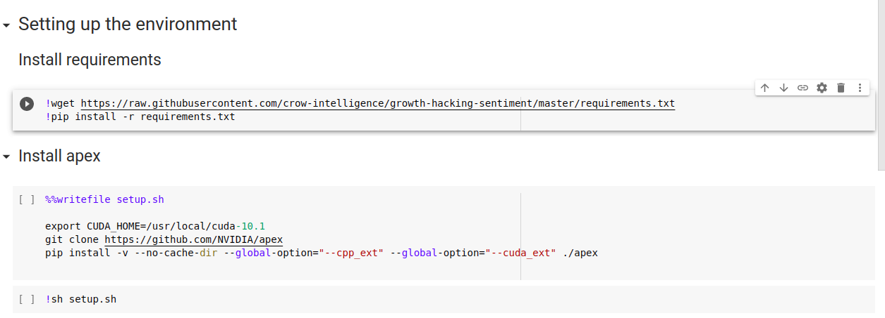

# Growth Hacking with NLP and Sentiment Analysis
This repo was made to the liveProject
[Growth Hacking with NLP and Sentiment Analysis](https://liveproject.manning.com/project/136).

## Table of Contents
* [Data](#data)
* [Install the dependencies](#install-the-dependencies)
* [Using Jupyter Notebooks](#using-jupyter-notebooks)
* [Using Colab](#using-colab)
* [Notes](#notes)
* [Reference implementations](#reference-implementations)
* [To the students](#to-the-students)
* [MIT License](#mit-license)

## Data
As you can see in our ```.gitignore``` file, the
repo needs a ```data``` folder. You can find our
data folder [here](https://drive.google.com/drive/folders/1rwd7hsZxZJdSQ7TP9CHgK9-qM20AJyib?usp=sharing).
NB! Here we provide a reference implementation,
your folder structure and the content of the
data folder (even its name) may be different 
from ours.

## Install the dependencies
Make a virtual environment and install the dependencies:
```shell script
pip install -r requirements.txt
```
Download data needed for the dictionary based sentiment analyzer.
Start Python in your virtual environment.
```Python
import nltk
nltk.download("opinion_lexicon")
nltk.download("stopwords")
nltk.download("punkt")
```
Having downloaded the data required by nltk, you can exit
your virtual environment.

## Using Jupyter Notebooks
Make a new environment, install the requirements.
Install notebook.
```shell script
pip install notebook
ipython kernel install --user --name=name-of-your-virtualenv
```
now you can start Jupyter.
```shell script
jupyter notebook
```
Don't forget to set your kernel as the picture shows
below.


Now, you are ready to work through the project! Happy hacking!

## Using Colab
[](https://colab.research.google.com/github/crow-intelligence/growth-hacking-sentiment/blob/master/Colab_growth_hacking_example.ipynb)

Click on the badge above to open our notebook in Colab.

Save it to your Google Drive. 


This step makes a Colab folder on your drive. Navigate
to this folder and make a data subfolder. Upload your
data files into this folder. 

First of all, set the runtime to GPU.


Run the scripts in the cells. They install the requirements
and the NVIDIA apex tool.



Run the cell after the "Connect your Colab notebook to your Drive"
section, so your Drive will be connected to your notebook.


You can access your corpus.csv uploaded into the folder
 "Colab/data" as:
 ```shell script
/content/drive/My Drive/Colab/data/corpus.csv
```

You can upload your training data to Drive. You
can also save your models and every intermediate data you
produce during the project to your Drive.

## Notes

Google provides you with a free notebook with the following
limitations.
>Google Colab notebooks have an idle timeout of 90 minute
> and absolute timeout of 12 hours. This means, if user does
>not interact with his Google Colab notebook for more than
>90 minutes, its instance is automatically terminated. Also,
>maximum lifetime of a Colab instance is 12 hours.

This means you have to set up your environment whenever
your Notebook gets disconnected.

## Reference implementations
You can find the reference implementations for 
milestones 1, 2, and 3 in the src folder as Python
scripts. You can find the reference
implementations for milestones 4 & 5 in the
notebooks folder. Also, you can open the
notebooks in Colab via clicking the badges
below.

+ Milestone 3 [](https://colab.research.google.com/github/crow-intelligence/growth-hacking-sentiment/blob/master/notebooks/nn_based_sentiment.ipynb)
+ Milestone 4 [](https://colab.research.google.com/github/crow-intelligence/growth-hacking-sentiment/blob/master/notebooks/final_report.ipynb)

To be able to run the notebooks on Colab,
you have to upload the data folder to
your Google Drive and possibly you have to
modify the path to the data in your
notebooks. Please read the [section on using Colab](https://github.com/crow-intelligence/growth-hacking-sentiment#using-colab)
before running the reference implementions.

We tested the code with Python 3.6, 3.7 and
3.8 under Linux (Ubuntu 18.04). The reference
implementation was made with vanilla Python 3.8


## To the students

Please feel free to submit an issue or send a pull request
if you find something buggy or if you need further clarifications.

## MIT License
> Copyright 2020 Orsolya Putz, Zoltan Varju

> Permission is hereby granted, free of charge, to any person obtaining a
 copy of this software and associated documentation files (the "Software"), to deal in the Software without restriction, including without limitation the rights to use, copy, modify, merge, publish, distribute, sublicense, and/or sell copies of the Software, and to permit persons to whom the Software is furnished to do so, subject to the following conditions:

> The above copyright notice and this permission notice shall be included in
 all copies or substantial portions of the Software.

> THE SOFTWARE IS PROVIDED "AS IS", WITHOUT WARRANTY OF ANY KIND, EXPRESS OR
 IMPLIED, INCLUDING BUT NOT LIMITED TO THE WARRANTIES OF MERCHANTABILITY, FITNESS FOR A PARTICULAR PURPOSE AND NONINFRINGEMENT. IN NO EVENT SHALL THE AUTHORS OR COPYRIGHT HOLDERS BE LIABLE FOR ANY CLAIM, DAMAGES OR OTHER LIABILITY, WHETHER IN AN ACTION OF CONTRACT, TORT OR OTHERWISE, ARISING FROM, OUT OF OR IN CONNECTION WITH THE SOFTWARE OR THE USE OR OTHER DEALINGS IN THE SOFTWARE.

