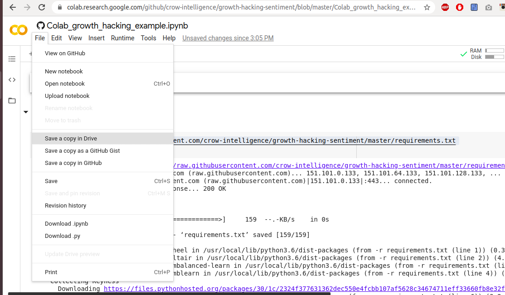
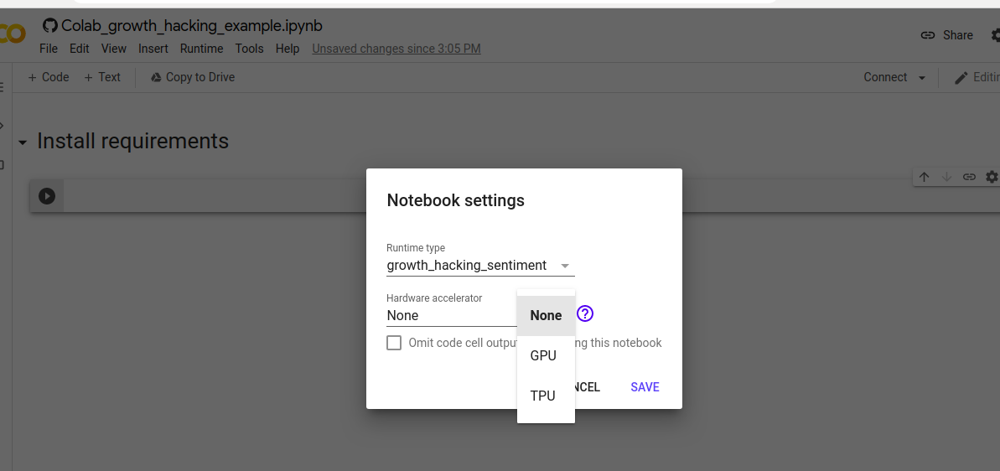

# Growth Hacking with NLP and Sentiment Analysis
This repo is made....

## Install the dependencies
Make a virtual environment and install the dependencies:
```shell script
pip install -r requirements.txt
```
Download data needed for the dictionary based sentiment.
Start Python in your virtual environment.
```Python
import nltk
nltk.download("opinion_lexicon")
nltk.download("stopwords")
nltk.download("punkt")
```
Having downloaded the data required by nltk, you can exit
your virtual environment.

## Using Jupyter Notebooks
Make a new environment, install the requirements.
Install notebook.
```shell script
pip install notebook
ipython kernel install --user --name=name-of-your-virtualenv
```
now you can start Jupyter.
```shell script
jupyter notebook
```
Don't forget to set your kernel as the picture shows
below.


Now, you are ready to work through the project! Happy hacking!

## Using Colab
[](https://colab.research.google.com/github/crow-intelligence/growth-hacking-sentiment/blob/master/Colab_growth_hacking_example.ipynb)

Click on the badge above to open our notebook in Colab.

Save it to your Google Drive. 


This step makes a Colab folder on your drive. Navigate
into this folder and make a data subfolder. Upload your
data files into this folder. 

First of all, set the runtime to GPU





Run the scripts in the cells. They install the requirements
and the NVIDIA apex tool.

Run the cell after the Connect your Colab notebook to your Drive
section, so your Drive will be connected to your notebook.

You can access your corpus.csv uploaded into the folder
 Colab/data as:
 ```shell script
/content/drive/Colab/data/corpus.csv
```

Google provides you with a free notebook with the following
limitations.
>Google Colab notebooks have an idle timeout of 90 minute
> and absolute timeout of 12 hours. This means, if user does
>not interact with his Google Colab notebook for more than
>90 minutes, its instance is automatically terminated. Also,
>maximum lifetime of a Colab instance is 12 hours.

This means you have to set up your environment whenever
your Notebook gets disconnected.

## Notes
Please fell free to submit an issue or send a pull request
if you find something buggy or if you think that something
needs further clarifications.